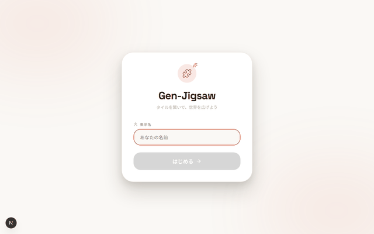

# Gen-Jigsaw

> Collaborative AI-powered outpainting puzzle — expand a shared world, one tile at a time.

Gen-Jigsaw is a multiplayer web app where players collaboratively build an ever-expanding image grid. Starting from a single seed tile, users generate new tiles in adjacent cells using AI image generation. The room owner curates the world by adopting or rejecting proposed expansions.



## Features

- **Collaborative world-building** — Multiple users expand the grid simultaneously
- **AI image generation** — Generate tiles via DALL-E 2 (or mock provider for development)
- **Real-time updates** — Server-Sent Events push room state to all participants
- **Lock system** — Optimistic locking prevents conflicting edits on the same cell (90s TTL)
- **Session auth** — Cookie-based session management via iron-session
- **Storage abstraction** — Pluggable provider pattern (local filesystem / S3 / R2)

## Getting Started

### Prerequisites

- Node.js 24+ (managed via [mise](https://mise.jdx.dev/))
- npm

### Setup

```bash
# Install dependencies
npm install

# Set up environment variables
cp .env.example .env
# Edit .env as needed (see .env.example for descriptions)

# Initialize the database
npm run db:push

# Start the development server
npm run dev
```

Open [http://localhost:3000](http://localhost:3000) in your browser.

### Quick Walkthrough

1. Enter a display name and click "Start"
2. Create a new room with "New Room"
3. Click "+" on an adjacent cell → enter a prompt → "Generate"
4. The room owner adopts or rejects the generated tile
5. Open another browser/incognito window to test multiplayer

## Tech Stack

| Technology | Version | Role |
|------------|---------|------|
| [Next.js](https://nextjs.org/) | 15 | App Router, API Routes |
| [React](https://react.dev/) | 19 | UI |
| [TypeScript](https://www.typescriptlang.org/) | 5 | Type safety |
| [TailwindCSS](https://tailwindcss.com/) | v4 | Styling |
| [Prisma](https://www.prisma.io/) | 6 | ORM |
| SQLite | — | Database (local) |
| [Zod](https://zod.dev/) | 3 | Validation |

## Architecture

### Data Flow

```
Client (React + Hooks) → Next.js API Routes → Prisma → SQLite
                       ← SSE (real-time updates)
```

### Key Directories

```
src/
├── app/api/              # API routes (REST endpoints)
├── app/room/[id]/        # Room detail page
├── components/canvas/    # Interactive grid with pan/zoom
├── components/expansion/ # Prompt input & candidate list UI
├── hooks/                # useUser, useRoom, useToast
├── lib/                  # Prisma singleton, Zod schemas, lock service
│   └── image-gen/        # Provider pattern for image generation
└── types/                # Shared TypeScript types
prisma/schema.prisma      # Database schema (User, Room, Tile, Expansion, Lock)
```

### Expansion Lifecycle

```
User clicks "+" → Acquire Lock → Enter Prompt → Create Expansion (QUEUED)
  → Run Image Generation (RUNNING → DONE)
  → Owner Adopts (→ ADOPTED, creates Tile) or Rejects (→ REJECTED)
```

Status transitions: `QUEUED → RUNNING → DONE → ADOPTED / REJECTED` (or `FAILED`)

## API Endpoints

| Method | Path | Description |
|--------|------|-------------|
| POST | `/api/users` | Create user (sets session cookie) |
| GET/DELETE | `/api/session` | Get current user / logout |
| GET | `/api/rooms` | List rooms |
| POST | `/api/rooms` | Create room (auto-generates seed tile at 0,0) |
| GET | `/api/rooms/:id` | Room detail (tiles, expansions, locks) |
| GET | `/api/rooms/:id/events` | SSE stream for real-time updates |
| POST | `/api/rooms/:id/generate-initial` | Generate initial tile image |
| POST | `/api/rooms/:id/locks` | Acquire lock |
| DELETE | `/api/rooms/:id/locks` | Release lock |
| POST | `/api/rooms/:id/expansions` | Create expansion |
| POST | `/api/expansions/:id/run` | Execute image generation |
| POST | `/api/expansions/:id/adopt` | Adopt expansion → create Tile |
| POST | `/api/expansions/:id/reject` | Reject expansion |

## Development

```bash
npm run dev          # Start dev server (localhost:3000)
npm run build        # Production build
npm run db:push      # Apply Prisma schema to SQLite
npm run db:studio    # Open Prisma Studio GUI
npx tsc --noEmit     # Type check
```

## License

[MIT](LICENSE) © 2026 kwrkb

---

<details>
<summary>🇯🇵 日本語</summary>

## Gen-Jigsaw

> 生成AI × 協働アウトペイントパズル — 1枚のタイルから、みんなで世界を広げよう。

Gen-Jigsaw は、複数人で協力して画像グリッドを拡張していくマルチプレイヤー Web アプリです。1枚の初期タイルから出発し、AIによる画像生成で隣接セルに新しいタイルを追加していきます。ルームオーナーが候補の採用・却下を判断し、世界をキュレーションします。

### 特徴

- **協働ワールド構築** — 複数ユーザーが同時にグリッドを拡張
- **AI画像生成** — DALL-E 2 対応（開発用モックプロバイダあり）
- **リアルタイム更新** — Server-Sent Events でルーム状態をプッシュ配信
- **ロックシステム** — 楽観的ロック（90秒TTL）で競合を防止
- **セッション認証** — iron-session による Cookie ベース認証
- **ストレージ抽象化** — プロバイダパターンで local / S3 / R2 を切替

### セットアップ

```bash
# 依存関係インストール
npm install

# 環境変数の設定
cp .env.example .env
# .env を編集（各変数の説明は .env.example を参照）

# DBセットアップ
npm run db:push

# 開発サーバー起動
npm run dev
```

ブラウザで [http://localhost:3000](http://localhost:3000) を開く。

### 動作確認手順

1. 表示名を入力 → 「はじめる」
2. 「+ 新しいルーム」でルーム作成
3. ルーム画面で初期タイル (0,0) を確認
4. 隣接セルの「+」をクリック → プロンプト入力 → 「生成する」
5. 生成完了後、オーナーが「採用」→ タイルがグリッドに追加される
6. 別ブラウザ/シークレットで2人目ユーザーとして参加 → マルチプレイを確認

### コマンド

```bash
npm run dev          # 開発サーバー起動
npm run build        # プロダクションビルド
npm run db:push      # Prisma スキーマを SQLite に適用
npm run db:studio    # Prisma Studio GUI を起動
npx tsc --noEmit     # 型チェック
```

### データモデル

- **Room** — ルーム。オーナーが採用/却下を判断
- **User** — 表示名のみ（セッション認証）
- **Tile** — 確定済みタイル。`(roomId, x, y)` でユニーク
- **Expansion** — 拡張候補。`QUEUED → RUNNING → DONE → ADOPTED/REJECTED`
- **Lock** — セルのロック（90秒TTL）。同一セルへの競合書き込みを防止

</details>
